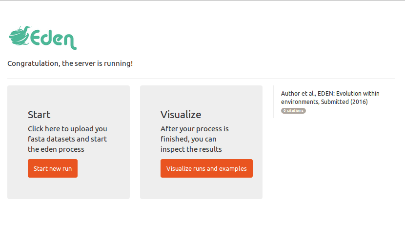
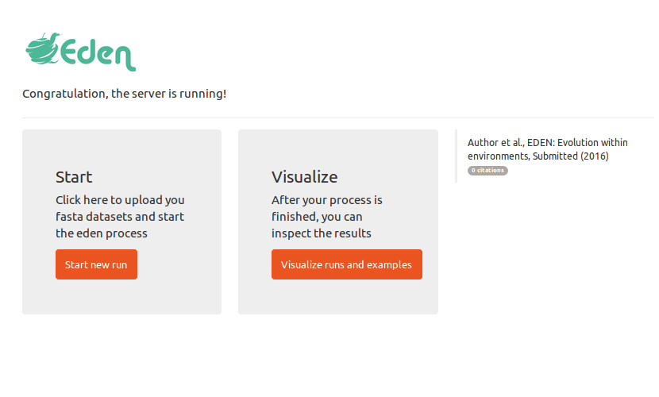

# EDEN - Evolutionary Dynamics within Environments

EDEN is the first software for the rapid detection of protein families and regions under positive selection, as well as their associated biological processes, from meta- and pangenome data. It provides an interactive result visualization for detailed comparative analyses.
 
## Table of Contents  
[Quick start](#quick-start)  
[Extended installation guide](#Extended-installation-guide)  
[Demo](#demo)  
[Development](#development)  
[FAQ](#faq)  

## Quick start
1. make sure you have installed [Docker](https://github.com/docker/docker) or install it via `sudo apt-get install docker.io`
2. make sure you have a up to date version of [Google Chrome](https://www.google.de/chrome/browser/desktop/) or [Mozilla Firefox](https://www.mozilla.org/de/firefox/new/)
3. download/start EDEN by typing `sudo docker run -p 80:3838 philippmuench/eden` (version with example files) you may want to use the smaller docker image without example files `sudo docker run -p 80:3838 philippmuench/eden:minimal`  
4. open your webbrowser and point it to [localhost](localhost), you should see the welcome screen
5. download [sample input files](https://github.com/philippmuench/eden/tree/master/sample_files) to test EDEN

## Extended installation guide
### Windows
1. see the tutorial https://docs.docker.com/docker-for-windows/ for installation and setting up docker on your windows machine
2. Press **WinKey + R**, Input `cmd` and press enter to start the **cmd.exe** to open the command promt
3. Type in the following command to download/start the docker image `sudo docker run -p 80:3838 edensoftware/eden` 
4. point your webbrowser to [localhost](localhost), you should see the welcome screen

### Amazon AWS (via Windows/Linux/macOS)
1. see https://aws.amazon.com/de/ec2/ and create an account and log in
2. go to **Dahsboard** and click on **Launch Instance** and select **Ubuntu Server 14.4 LTS**
3. choose the size of of server you want to rent, **t2.micro** is maybe free for some users
4. click on **Next:Configure Instance Details** and click on **Next: Add Storage**. On the **Size (GiB)** box add 20GB. Click on **Next Add Tags** and **Next: Configure Security Groups**. Click on **Add Rule** and add a **Custom TCP Rule (TCP)** with port range: `80` and select **Source: Anywhere**. Click on **Review and Launch** and **Launch**
5. create a new key pair, and download this file to your local machine
6. click **View Instance** and wait till the **Instance State** goes from **pending/initializing** to **running**
7. click on "Launch Instance" and select **A Java SSH Client directly from my browser (Java required)** add add the path to the .pem file you downloaded in step 5. 
10. On the terminal screen execute the command: `sudo apt-get install docker.io && sudo docker run -p 80:3838 edensoftware/eden`
11. point your browser to the **Public DNS** or **Public IP** of your instance (i.e. `ec2-54-90-153-208.compute-1.amazonaws.com`)(under the **Description** Tab in the **Instance** Page in the aws administration panel)

## Demo
### Submit a new job


### Visualize results



## FAQ

 > Should one upload raw sequencing reads or (partially) assembled sequences?If one is preferred, why?  

Currently, EDEN is optimized to work with assembled input files. Inside EDEN we use HMMER to find gene families found in the input sequences, here we check also for a overlap of the HMM model and the input sequences. If the input sequences are too small this filter process may be too stringend.

> What is the minimum fold-coverage of a given gene family below which meaningful analysis is not possible?  

EDEN reaches comparable results to HyPhy SLAC for gene families that contain 3 or more sequences in their alignment. If less than two sequences found for a gene family, the gene family will not be processed.

> How many files, and at what file sizes, can the pipeline handle?  

> How does computation time scale with number of nucleotides submitted?  

Please note, that this pipeline needs to be executed on the user's machine or on a cloud (such as Amazon EC2 instances) and currently we not offer computational resources for this software and the link in the manuscripts are currently for providing example output to the reader. See the [Extended installation guide](#Extended-installation-guide) if you plan to install the software on the cloud service 'Amazon AWS', one of the most used cloud services. Based on this, the runtime of the pipeline is only limited to the users server capability which can be nearly unlimited in case of Amazon EC2 machines (because the runtime is linear with the number of input files and HMM models). 

## Development
### Rebuild docker image 

you can build the docker image from scratch:

```
git clone https://github.com/philippmuench/eden.git
cd eden
sudo docker build -t eden_local .
sudo docker run -p 80:3838 eden_local
# point browser to localhost
```

during the build process the GUI will be installed from https://github.com/philippmuench/eden_ui
if you want to make changes on the UI, you need to clone this repo and change the path to it in the `Dockerfile`
